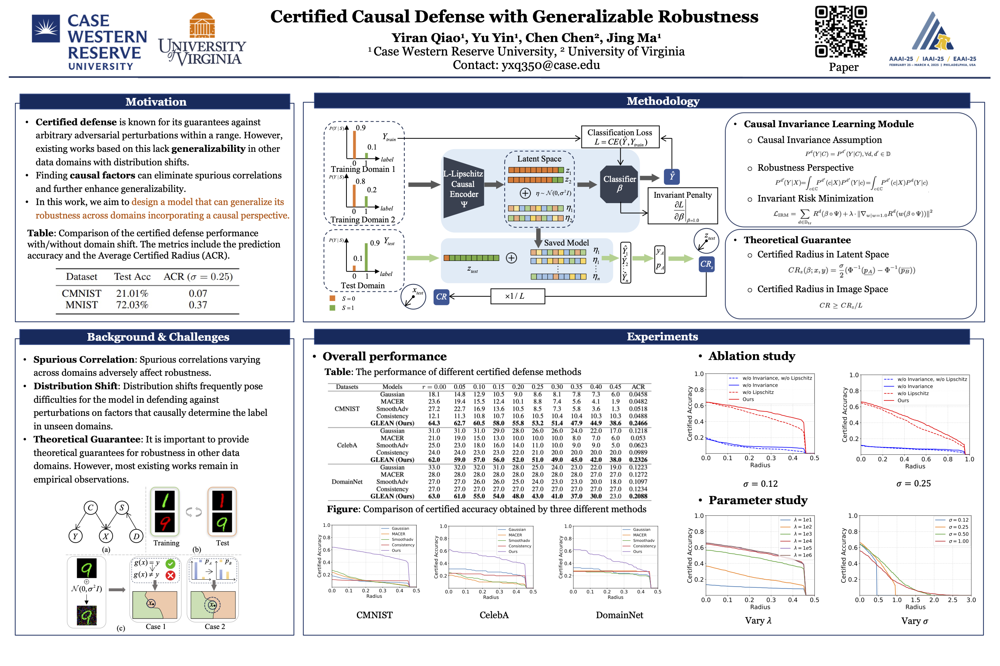

<div align="center">

# [AAAI 2025] Certified Causal Defense with Generalizable Robustness

Yiran Qiao, Yu Yin, Chen Chen, Jing Ma<sup>*</sup>

<sup>*</sup>Corresponding author

<!-- Official implementation for **Certified Causal Defense with Generalizable Robustness**. -->

[](https://arxiv.org/pdf/2408.15451)

</div>



## Introduction

This repository contains the code for **Certified Causal Defense with Generalizable Robustness**. The work studies certified robustness under distribution shift, where models must remain robust not only on the training distribution but also on shifted test domains. The proposed framework, **GLEAN**, combines causal factor learning with randomized smoothing so that the certified defense can reduce the effect of spurious correlations and improve robustness generalization across domains.

For convenience, the code is organized by dataset. Each dataset has its own training, certification, analysis, architecture, and utility files, so experiments can be run independently:

```text
Glean/
├── Code_for_CMNIST/
├── Code_for_CelebA/
└── Code_for_DomainNet/
```

All default hyperparameters and file paths are set inside the corresponding Python files. You can run the scripts directly with their defaults, or modify the command-line arguments and hard-coded dataset paths for your own environment.

## Installation

The code requires **Python 3.11** with PyTorch and CUDA support. We recommend creating a dedicated conda environment:

```bash
git clone https://github.com/yrqiao/Glean.git
cd Glean
conda create -n glean python=3.11
conda activate glean
pip install -r requirements.txt
```

## Data Preparation

We provide two ways to prepare the data.

### Option 1: Use the Provided Pickle Files

For convenience, preprocessed pickle files are included for CelebA and DomainNet:

```text
Code_for_CelebA/
├── train_env1_smile.pickle
├── train_env2_smile.pickle
└── test_env_smile.pickle

Code_for_DomainNet/
├── train_env1_DomainNet.pickle
├── train_env2_DomainNet.pickle
└── test_env_DomainNet.pickle
```

If these files are present, you can skip preprocessing and go directly to training. CMNIST is generated from `torchvision.datasets.MNIST` inside `train.py` and `certify.py`.

### Option 2: Preprocess from Raw Data

You can also download the raw data files and regenerate the pickle files.

Download links:


CelebA:    [download link](https://drive.google.com/drive/folders/1VKh6creE3WM_spxL1YdPD2cRq3AEzIp7?usp=sharing)
DomainNet: [download link](https://drive.google.com/drive/folders/1zajwPbbJkZ435rmZzePKFoVLK71bB1jh?usp=drive_link)


Then place the required metadata files in the corresponding folders:

```text
Code_for_CelebA/list_attr_celeba.txt
Code_for_DomainNet/DomainNet_attr.xlsx
```

Run preprocessing from inside each dataset folder:

```bash
cd /Your/root/path/Code_for_CelebA
python process_data.py
```

```bash
cd /Your/root/path/Code_for_DomainNet
python process_data.py
```

The scripts will create the train/test environment pickle files used by `train.py` and `certify.py`.

Note that the image root paths are currently set inside the dataset scripts. If your data is stored somewhere else, update the paths in the corresponding `train.py` and `certify.py` files before running experiments.

## Training

Run `train.py` in the dataset folder you want to evaluate. The trained checkpoints are saved to `./saved_model/` inside that folder.

### CMNIST

```bash
cd /Your/root/path/Code_for_CMNIST
python train.py
```

By default, CMNIST saves checkpoints every 100 steps, for example:

```text
saved_model/model_500.pth
```

### CelebA

```bash
cd /Your/root/path/Code_for_CelebA
python train.py --dataset_path /your/dataset/path
```

By default, CelebA saves a checkpoint after every epoch, for example:

```text
saved_model/model_40.pth
```

### DomainNet

```bash
cd /Your/root/path/Code_for_DomainNet
python train.py --dataset_path /your/dataset/path
```

By default, DomainNet saves checkpoints every 10 epochs, for example:

```text
saved_model/model_200.pth
```

You can override parameters from the command line. For example:

```bash
python train.py --lr 0.001 --noise_sd 0.12 --epochs 51
```

The exact available arguments are defined in each dataset's `train.py`.

## Certification

After training, select the best checkpoint and run `certify.py` in the same dataset folder. The certification output is written as a tab-separated file containing the example index, label, prediction, certified radius, correctness, and runtime.

### CMNIST

```bash
cd /Your/root/path/Code_for_CMNIST
python certify.py --base_classifier ./saved_model/model_500.pth --outfile output_file
```

### CelebA

```bash
cd /Your/root/path/Code_for_CelebA
python certify.py --base_classifier ./saved_model/model_40.pth --outfile output_file
```

### DomainNet

```bash
cd /Your/root/path/Code_for_DomainNet
python certify.py --base_classifier ./saved_model/model_200.pth --outfile output_file
```

Important certification arguments include:

```text
--base_classifier   path to the trained .pth checkpoint
--sigma             Gaussian noise level for randomized smoothing
--outfile           output file for certified radii and correctness
--N0                number of samples for class selection
--N                 number of samples for radius estimation
--alpha             failure probability
--batch             certification batch size
```

The defaults are already set in each `certify.py`, but you can change them to trade off runtime and certification tightness.

## Analysis and Plots

After certification, run `analyze.py` to generate the certified accuracy plot from the certification output file.

```bash
cd /Your/root/path/Code_for_CMNIST
python analyze.py
```

```bash
cd /Your/root/path/Code_for_CelebA
python analyze.py
```

```bash
cd /Your/root/path/Code_for_DomainNet
python analyze.py
```

By default, `analyze.py` reads:

```text
./output_file
```

and saves:

```text
Figure_0.12.pdf
Figure_0.12.png
```

If you use a different certification output filename or want to compare multiple methods, modify the `Line(ApproximateAccuracy(...), ...)` entries at the bottom of `analyze.py`.

## Notes

- Run each script from inside its dataset folder so relative paths such as `./saved_model`, `./output_file`, and the pickle filenames resolve correctly.
- The default parameters are stored directly in each Python file and can be modified either by command-line arguments or by editing the scripts.
- `train.py` saves model checkpoints, `certify.py` loads a selected checkpoint and computes certified radii, and `analyze.py` converts the certification output into plots.
- For CelebA and DomainNet, make sure the image root paths in `train.py` and `certify.py` match your local dataset location.

## Citation

If you find this repository useful, please cite:

```bibtex
@article{qiao2024certified,
  title={Certified Causal Defense with Generalizable Robustness},
  author={Qiao, Yiran and Yin, Yu and Chen, Chen and Ma, Jing},
  journal={arXiv preprint arXiv:2408.15451},
  year={2024}
}
```
